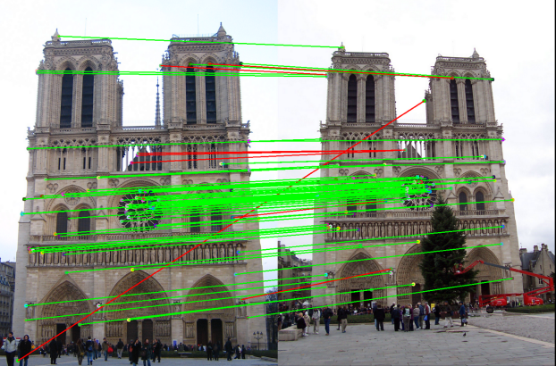
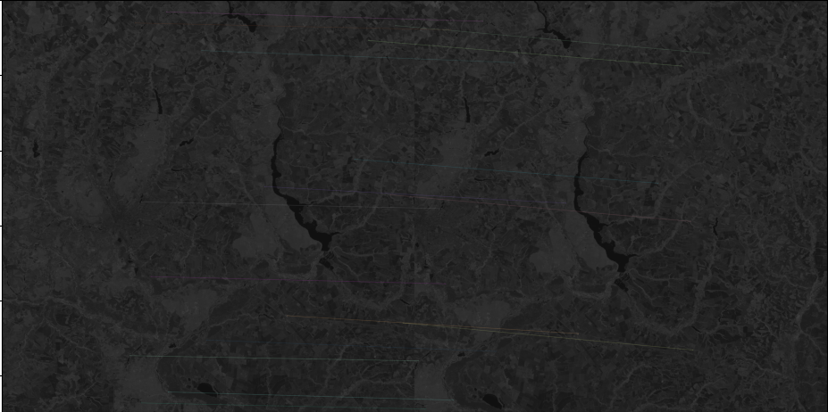

# FM_Sentinel-2

# Task

Computer vision.

Sentinel-2 image matching In this task, you will work on the algorithm (or model) for matching satellite images. 
For the dataset creation, you can download Sentinel-2 images from the official source here or use our dataset from Kaggle. 
Your algorithm should work with images from different seasons. 
For this purpose you need: 
-  Prepare a dataset for keypoints detection and image matching (in case of using the ML approach). 
- Build / train the algorithm.
- Prepare demo code / notebook of the inference results. 
The output for this task should contain: 
- Jupyter notebook that explains the process of the dataset creation. ● Link to the dataset (Google Drive, etc.).
- Link to model weights. 
- Python script (.py) for model training or algorithm creation. 
- Python script (.py) for model inference. 
- Jupyter notebook with demo should have the functionality for observing detected keypoints and their matches:



 Recommendation: 
- Classical solutions can be not accurate enough for images from different seasons. 
- Satellite images have large sizes. 
You should think about how to process them in order not to lose the quality. 
- Some initial knowledge about satellite imagery processing you can find here.

# Overview
This repository contains Python scripts for training and inference of a Named Entity Recognition (NER) model based 
on BERT (Bidirectional Encoder Representations from Transformers). The training script (train_NER.py) trains the model
on a custom dataset and saves the trained model. The inference script (inference_NER.py) loads the trained model
and performs predictions on new input text.

# Requirements
- Python 3.x
- OpenCV-python
- Other dependencies (install using "pip install -r requirements.txt")

# Usage
- update project from Git
- create virtual environment

```bash
pip install -r requirements.txt
```
Run train_NER.py for create and training model
```bash
python  figure_matching.py
```
Input link to first image. Press Enter
Input link to second image. Press Enter
Watch result in "output_image.jpg"



# Conclusion

Choose SIFT because it better with different light gradient. 
Use B8A chanel because it was more stable and did not depend on the season and small size.
Save without compressing for easy validation. Draw first 20 matches.